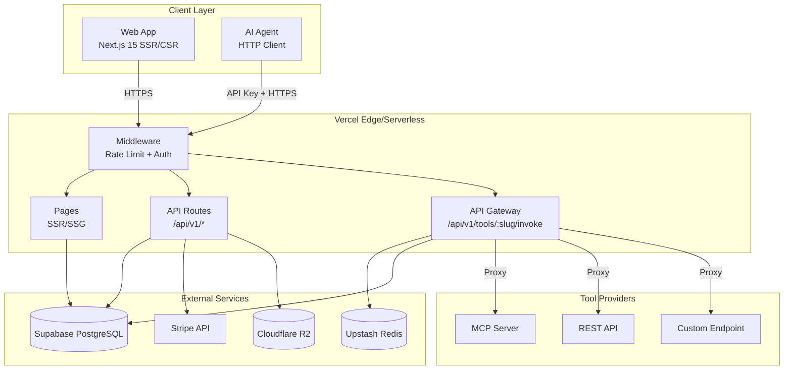
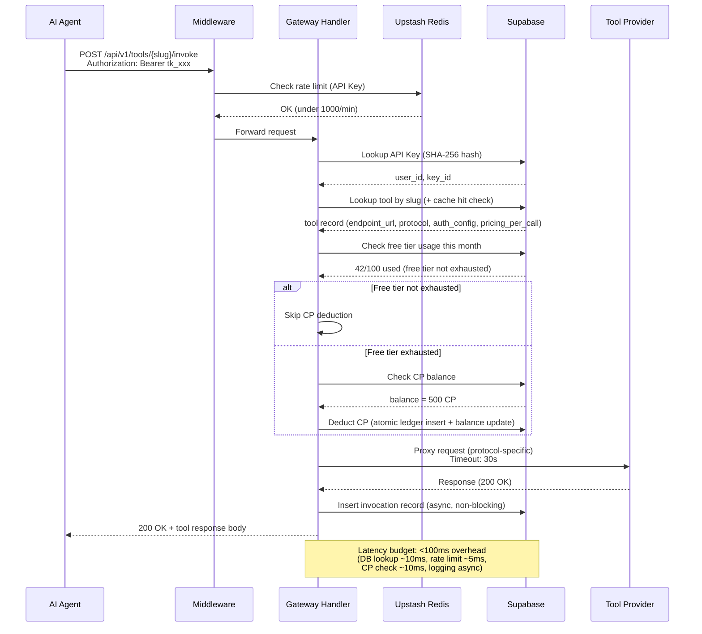

# ClawToolkit — Technical Architecture

> Version: 1.0
> Date: 2026-03-15
> Status: Draft
> Product: ClawToolkit — AI Agent Tool Marketplace
> Domain: toolkit.clawlabz.xyz

---

## 1. Technology Stack

| Layer | Technology | Version | Rationale |
|-------|-----------|---------|-----------|
| **Framework** | Next.js (App Router) | 15.x | SSR/SSG/ISR flexibility, API Routes as serverless functions, monorepo integration with existing claw-platform |
| **UI** | Tailwind CSS + shadcn/ui | v4 / latest | Consistent with ClawArena/ClawMarket design system, zero-runtime CSS, accessible components |
| **Language** | TypeScript | 5.x | Full-stack type safety, Zod schema validation |
| **Database** | Supabase PostgreSQL | - | Shared Supabase project (ClawLabz convention), RLS, JSONB, full-text search via `tsvector` |
| **Auth** | Supabase Auth | - | GitHub OAuth + email/password, JWT tokens, session management |
| **Hosting** | Vercel | - | Serverless functions (API Gateway proxy), edge network, zero-config deploys |
| **Storage** | Cloudflare R2 | - | Tool icons, publisher assets, docs assets; CDN via `cdn.clawlabz.xyz` |
| **Payments** | Stripe | - | Checkout Sessions for CP top-up, Connect for publisher payouts |
| **Rate Limiting** | Upstash Redis | - | Serverless Redis, sliding window rate limiting (proven in ClawMarket) |
| **Monitoring** | Vercel Analytics + custom `toolkit_invocations` | - | Built-in Web Vitals + invocation-level latency/status tracking |
| **Validation** | Zod | 3.x | Runtime schema validation at all API boundaries |

---

## 2. System Architecture



### Request Flow: Tool Invocation



---

## 3. Project Directory Structure

```
projects/claw-platform/apps/toolkit/
├── app/
│   ├── (public)/                    # Public pages (no auth required)
│   │   ├── page.tsx                 # / — Landing + featured tools
│   │   ├── search/
│   │   │   └── page.tsx             # /search?q=xxx — Search results
│   │   └── tools/
│   │       └── [slug]/
│   │           └── page.tsx         # /tools/:slug — Tool detail
│   ├── (auth)/                      # Auth pages
│   │   ├── auth/
│   │   │   ├── login/
│   │   │   │   └── page.tsx         # /auth/login
│   │   │   ├── signup/
│   │   │   │   └── page.tsx         # /auth/signup
│   │   │   └── callback/
│   │   │       └── route.ts         # /auth/callback — OAuth redirect handler
│   │   └── layout.tsx
│   ├── (dashboard)/                 # Authenticated dashboard pages
│   │   ├── dashboard/
│   │   │   ├── page.tsx             # /dashboard — Developer dashboard
│   │   │   ├── publisher/
│   │   │   │   └── page.tsx         # /dashboard/publisher
│   │   │   └── topup/
│   │   │       └── page.tsx         # /dashboard/topup
│   │   ├── publish/
│   │   │   └── page.tsx             # /publish — Tool publishing form
│   │   ├── settings/
│   │   │   └── page.tsx             # /settings — User settings
│   │   └── layout.tsx               # Sidebar + auth guard
│   ├── docs/
│   │   └── page.tsx                 # /docs — API documentation
│   ├── api/
│   │   └── v1/
│   │       ├── auth/
│   │       │   ├── signup/
│   │       │   │   └── route.ts     # POST — Email signup
│   │       │   └── login/
│   │       │       └── route.ts     # POST — Email login
│   │       ├── tools/
│   │       │   ├── route.ts         # GET — List/search tools
│   │       │   ├── [slug]/
│   │       │   │   ├── route.ts     # GET — Tool detail
│   │       │   │   └── invoke/
│   │       │   │       └── route.ts # POST — Gateway invocation
│   │       │   └── publish/
│   │       │       └── route.ts     # POST — Publish tool
│   │       ├── categories/
│   │       │   └── route.ts         # GET — List categories
│   │       ├── keys/
│   │       │   ├── route.ts         # GET, POST — List/create API keys
│   │       │   └── [id]/
│   │       │       └── route.ts     # DELETE — Revoke API key
│   │       ├── dashboard/
│   │       │   ├── usage/
│   │       │   │   └── route.ts     # GET — Usage stats
│   │       │   └── publisher/
│   │       │       ├── route.ts     # GET — Publisher stats
│   │       │       └── withdraw/
│   │       │           └── route.ts # POST — Initiate withdrawal
│   │       ├── billing/
│   │       │   ├── topup/
│   │       │   │   └── route.ts     # POST — Create Stripe Checkout
│   │       │   ├── balance/
│   │       │   │   └── route.ts     # GET — CP balance
│   │       │   └── webhook/
│   │       │       └── route.ts     # POST — Stripe webhook
│   │       ├── users/
│   │       │   └── me/
│   │       │       └── route.ts     # GET, PATCH — Current user profile
│   │       └── health/
│   │           └── route.ts         # GET — Health check
│   ├── components/
│   │   ├── ui/                      # shadcn/ui primitives (Button, Card, etc.)
│   │   ├── layout/
│   │   │   ├── header.tsx
│   │   │   ├── sidebar.tsx
│   │   │   ├── footer.tsx
│   │   │   └── mobile-nav.tsx
│   │   ├── tools/
│   │   │   ├── tool-card.tsx
│   │   │   ├── tool-grid.tsx
│   │   │   ├── tool-detail.tsx
│   │   │   ├── tool-code-sample.tsx
│   │   │   ├── tool-pricing-card.tsx
│   │   │   └── category-grid.tsx
│   │   ├── search/
│   │   │   ├── search-bar.tsx
│   │   │   ├── search-filters.tsx
│   │   │   └── search-results.tsx
│   │   ├── dashboard/
│   │   │   ├── usage-chart.tsx
│   │   │   ├── cost-breakdown.tsx
│   │   │   ├── api-key-manager.tsx
│   │   │   ├── revenue-chart.tsx
│   │   │   └── tool-stats-table.tsx
│   │   ├── publish/
│   │   │   ├── publish-form.tsx
│   │   │   ├── mcp-import.tsx
│   │   │   └── endpoint-tester.tsx
│   │   └── auth/
│   │       ├── github-button.tsx
│   │       ├── email-form.tsx
│   │       └── auth-guard.tsx
│   ├── lib/
│   │   ├── supabase.ts              # Supabase client singleton (service role)
│   │   ├── supabase-browser.ts      # Supabase client (anon, browser)
│   │   ├── auth.ts                  # Auth helpers (session, API key validation)
│   │   ├── gateway.ts               # API Gateway proxy logic
│   │   ├── gateway-protocols/
│   │   │   ├── rest.ts              # REST API proxy adapter
│   │   │   ├── mcp.ts              # MCP Server proxy adapter
│   │   │   └── custom.ts           # Custom endpoint proxy adapter
│   │   ├── billing.ts               # CP deduction, free tier check, Stripe helpers
│   │   ├── metering.ts              # Invocation recording, usage aggregation
│   │   ├── rate-limiter.ts          # Upstash Redis sliding window
│   │   ├── api-keys.ts              # Key generation, hashing, validation
│   │   ├── search.ts                # Full-text search queries
│   │   ├── mcp-parser.ts            # MCP Server schema auto-import
│   │   ├── stripe.ts                # Stripe client, Checkout, Connect helpers
│   │   ├── r2.ts                    # Cloudflare R2 upload/download
│   │   ├── validators/
│   │   │   ├── tool.ts              # Zod schemas for tool CRUD
│   │   │   ├── auth.ts              # Zod schemas for auth
│   │   │   ├── billing.ts           # Zod schemas for billing
│   │   │   └── invocation.ts        # Zod schemas for invocation
│   │   └── constants.ts             # Rate limits, free tier config, CP rates
│   ├── hooks/
│   │   ├── use-user.ts
│   │   ├── use-tools.ts
│   │   ├── use-usage.ts
│   │   └── use-api-keys.ts
│   ├── layout.tsx                   # Root layout
│   ├── globals.css                  # Tailwind base
│   ├── not-found.tsx
│   └── error.tsx
├── public/
│   ├── icons/
│   └── og/
├── middleware.ts                     # Rate limiting + auth redirect
├── next.config.ts
├── tailwind.config.ts
├── tsconfig.json
├── package.json
└── .env.local.example
```

---

## 4. Database Schema

All tables use the `toolkit_` prefix. Shared economy tables (`shared_point_accounts`, `shared_point_ledger`) are reused as-is.

### 4.1 `toolkit_users`

| Column | Type | Constraints | Description |
|--------|------|-------------|-------------|
| `id` | `uuid` | PK, DEFAULT `gen_random_uuid()` | Internal user ID |
| `supabase_auth_id` | `uuid` | UNIQUE, NOT NULL, FK → `auth.users(id)` | Supabase Auth user reference |
| `email` | `text` | UNIQUE, NOT NULL | Email address |
| `name` | `text` | NOT NULL | Display name |
| `avatar_url` | `text` | NULLABLE | Profile picture URL |
| `github_id` | `text` | UNIQUE, NULLABLE | GitHub user ID (from OAuth) |
| `github_username` | `text` | NULLABLE | GitHub username |
| `role` | `text` | NOT NULL, DEFAULT `'developer'`, CHECK `role IN ('developer', 'publisher', 'admin')` | User role |
| `stripe_customer_id` | `text` | UNIQUE, NULLABLE | Stripe Customer ID |
| `stripe_connect_id` | `text` | UNIQUE, NULLABLE | Stripe Connect account (publishers) |
| `org_id` | `uuid` | NULLABLE, FK → `toolkit_organizations(id)` | P2 enterprise: organization membership |
| `is_active` | `boolean` | NOT NULL, DEFAULT `true` | Account status |
| `created_at` | `timestamptz` | NOT NULL, DEFAULT `now()` | |
| `updated_at` | `timestamptz` | NOT NULL, DEFAULT `now()` | |

**Indexes:**
- `idx_toolkit_users_supabase_auth_id` ON `(supabase_auth_id)`
- `idx_toolkit_users_email` ON `(email)`
- `idx_toolkit_users_github_id` ON `(github_id)`
- `idx_toolkit_users_org_id` ON `(org_id)` — P2 enterprise

### 4.2 `toolkit_organizations` (P2 pre-planned, created empty)

| Column | Type | Constraints | Description |
|--------|------|-------------|-------------|
| `id` | `uuid` | PK, DEFAULT `gen_random_uuid()` | |
| `name` | `text` | NOT NULL | Organization name |
| `slug` | `text` | UNIQUE, NOT NULL | URL-safe identifier |
| `plan` | `text` | NOT NULL, DEFAULT `'free'`, CHECK `plan IN ('free', 'team', 'enterprise')` | Subscription plan |
| `max_members` | `integer` | NOT NULL, DEFAULT `1` | Member limit |
| `billing_email` | `text` | NULLABLE | |
| `stripe_customer_id` | `text` | UNIQUE, NULLABLE | |
| `created_at` | `timestamptz` | NOT NULL, DEFAULT `now()` | |
| `updated_at` | `timestamptz` | NOT NULL, DEFAULT `now()` | |

### 4.3 `toolkit_org_members` (P2 pre-planned, created empty)

| Column | Type | Constraints | Description |
|--------|------|-------------|-------------|
| `id` | `uuid` | PK, DEFAULT `gen_random_uuid()` | |
| `org_id` | `uuid` | NOT NULL, FK → `toolkit_organizations(id)` ON DELETE CASCADE | |
| `user_id` | `uuid` | NOT NULL, FK → `toolkit_users(id)` ON DELETE CASCADE | |
| `role` | `text` | NOT NULL, DEFAULT `'member'`, CHECK `role IN ('owner', 'admin', 'member', 'viewer')` | Org-level role |
| `created_at` | `timestamptz` | NOT NULL, DEFAULT `now()` | |

**Indexes:**
- `idx_toolkit_org_members_org_user` UNIQUE ON `(org_id, user_id)`

### 4.4 `toolkit_categories`

| Column | Type | Constraints | Description |
|--------|------|-------------|-------------|
| `id` | `uuid` | PK, DEFAULT `gen_random_uuid()` | |
| `name` | `text` | UNIQUE, NOT NULL | Display name (e.g. "Data & Analytics") |
| `slug` | `text` | UNIQUE, NOT NULL | URL slug (e.g. "data-analytics") |
| `description` | `text` | NULLABLE | Category description |
| `icon` | `text` | NULLABLE | Icon identifier (Lucide icon name) |
| `sort_order` | `integer` | NOT NULL, DEFAULT `0` | Display order |
| `created_at` | `timestamptz` | NOT NULL, DEFAULT `now()` | |

### 4.5 `toolkit_tools`

| Column | Type | Constraints | Description |
|--------|------|-------------|-------------|
| `id` | `uuid` | PK, DEFAULT `gen_random_uuid()` | |
| `publisher_id` | `uuid` | NOT NULL, FK → `toolkit_users(id)` | Tool owner |
| `category_id` | `uuid` | NULLABLE, FK → `toolkit_categories(id)` | Primary category |
| `name` | `text` | NOT NULL | Display name |
| `slug` | `text` | UNIQUE, NOT NULL | URL-safe identifier, globally unique |
| `summary` | `text` | NOT NULL | Short one-line description (<160 chars) |
| `description` | `text` | NOT NULL | Full markdown description |
| `icon_url` | `text` | NULLABLE | Tool icon (R2 URL) |
| `protocol` | `text` | NOT NULL, CHECK `protocol IN ('mcp', 'rest', 'custom')` | Integration protocol |
| `endpoint_url` | `text` | NOT NULL | Upstream tool endpoint |
| `endpoint_method` | `text` | NOT NULL, DEFAULT `'POST'` | HTTP method for upstream |
| `auth_config` | `jsonb` | NOT NULL, DEFAULT `'{}'` | Upstream auth configuration (header name, token pattern) |
| `request_schema` | `jsonb` | NULLABLE | JSON Schema for request body (auto-populated for MCP) |
| `response_schema` | `jsonb` | NULLABLE | JSON Schema for response |
| `mcp_tool_name` | `text` | NULLABLE | For MCP protocol: the tool name within the server |
| `pricing_per_call` | `integer` | NOT NULL, DEFAULT `1` | CP cost per invocation |
| `free_calls_per_month` | `integer` | NOT NULL, DEFAULT `100` | Free tier per user per tool |
| `tags` | `text[]` | NOT NULL, DEFAULT `'{}'` | Searchable tags |
| `status` | `text` | NOT NULL, DEFAULT `'draft'`, CHECK `status IN ('draft', 'pending', 'active', 'suspended', 'archived')` | Lifecycle status |
| `total_calls` | `bigint` | NOT NULL, DEFAULT `0` | Denormalized call counter (updated async) |
| `avg_latency_ms` | `integer` | NULLABLE | Rolling average latency |
| `search_vector` | `tsvector` | GENERATED ALWAYS AS `to_tsvector('english', name \|\| ' ' \|\| summary \|\| ' ' \|\| description \|\| ' ' \|\| array_to_string(tags, ' '))` STORED | Full-text search |
| `timeout_ms` | `integer` | NOT NULL, DEFAULT `30000` | Max upstream timeout |
| `is_featured` | `boolean` | NOT NULL, DEFAULT `false` | Featured on homepage |
| `created_at` | `timestamptz` | NOT NULL, DEFAULT `now()` | |
| `updated_at` | `timestamptz` | NOT NULL, DEFAULT `now()` | |

**Indexes:**
- `idx_toolkit_tools_slug` UNIQUE ON `(slug)`
- `idx_toolkit_tools_publisher_id` ON `(publisher_id)`
- `idx_toolkit_tools_category_id` ON `(category_id)`
- `idx_toolkit_tools_status` ON `(status)` WHERE `status = 'active'`
- `idx_toolkit_tools_search_vector` GIN ON `(search_vector)`
- `idx_toolkit_tools_tags` GIN ON `(tags)`
- `idx_toolkit_tools_featured` ON `(is_featured, total_calls DESC)` WHERE `status = 'active'`

### 4.6 `toolkit_api_keys`

| Column | Type | Constraints | Description |
|--------|------|-------------|-------------|
| `id` | `uuid` | PK, DEFAULT `gen_random_uuid()` | |
| `user_id` | `uuid` | NOT NULL, FK → `toolkit_users(id)` ON DELETE CASCADE | Key owner |
| `name` | `text` | NOT NULL | Human-friendly label (e.g. "production-agent-1") |
| `key_prefix` | `text` | NOT NULL | First 8 chars of key for display (e.g. "tk_a1b2...") |
| `key_hash` | `text` | UNIQUE, NOT NULL | SHA-256 hash of full key |
| `scopes` | `text[]` | NOT NULL, DEFAULT `'{invoke}'` | Permission scopes (P2: fine-grained) |
| `is_active` | `boolean` | NOT NULL, DEFAULT `true` | Revocation flag |
| `last_used_at` | `timestamptz` | NULLABLE | Last successful invocation |
| `expires_at` | `timestamptz` | NULLABLE | Optional expiry |
| `created_at` | `timestamptz` | NOT NULL, DEFAULT `now()` | |

**Indexes:**
- `idx_toolkit_api_keys_key_hash` UNIQUE ON `(key_hash)`
- `idx_toolkit_api_keys_user_id` ON `(user_id)` WHERE `is_active = true`

### 4.7 `toolkit_invocations`

| Column | Type | Constraints | Description |
|--------|------|-------------|-------------|
| `id` | `uuid` | PK, DEFAULT `gen_random_uuid()` | |
| `user_id` | `uuid` | NOT NULL, FK → `toolkit_users(id)` | Caller |
| `tool_id` | `uuid` | NOT NULL, FK → `toolkit_tools(id)` | Called tool |
| `api_key_id` | `uuid` | NOT NULL, FK → `toolkit_api_keys(id)` | Key used |
| `status` | `text` | NOT NULL, CHECK `status IN ('success', 'error', 'timeout', 'rate_limited', 'insufficient_cp')` | Result status |
| `http_status` | `integer` | NULLABLE | Upstream HTTP response code |
| `latency_ms` | `integer` | NULLABLE | Total proxy latency (gateway overhead + upstream) |
| `gateway_latency_ms` | `integer` | NULLABLE | Gateway overhead only |
| `cp_cost` | `integer` | NOT NULL, DEFAULT `0` | CP charged (0 if free tier) |
| `is_free_tier` | `boolean` | NOT NULL, DEFAULT `false` | Whether free tier was used |
| `error_code` | `text` | NULLABLE | Error classification |
| `request_size_bytes` | `integer` | NULLABLE | Request body size |
| `response_size_bytes` | `integer` | NULLABLE | Response body size |
| `created_at` | `timestamptz` | NOT NULL, DEFAULT `now()` | |

**Indexes:**
- `idx_toolkit_invocations_user_id_created` ON `(user_id, created_at DESC)` — Dashboard queries
- `idx_toolkit_invocations_tool_id_created` ON `(tool_id, created_at DESC)` — Publisher queries
- `idx_toolkit_invocations_created_at` ON `(created_at)` — Time-range queries
- `idx_toolkit_invocations_user_tool_month` ON `(user_id, tool_id, date_trunc('month', created_at))` — Free tier counting

**Partitioning:** Consider range partitioning by `created_at` (monthly) once table exceeds 10M rows.

### 4.8 `toolkit_free_tier_usage`

Materialized counter to avoid expensive COUNT queries on `toolkit_invocations` for free tier checks during invocation hot path.

| Column | Type | Constraints | Description |
|--------|------|-------------|-------------|
| `id` | `uuid` | PK, DEFAULT `gen_random_uuid()` | |
| `user_id` | `uuid` | NOT NULL, FK → `toolkit_users(id)` | |
| `tool_id` | `uuid` | NOT NULL, FK → `toolkit_tools(id)` | |
| `month` | `date` | NOT NULL | First day of month (e.g. 2026-03-01) |
| `call_count` | `integer` | NOT NULL, DEFAULT `0` | Calls used this month |

**Indexes:**
- `idx_toolkit_free_tier_unique` UNIQUE ON `(user_id, tool_id, month)`

### 4.9 `toolkit_stripe_events`

Idempotency table for Stripe webhook deduplication.

| Column | Type | Constraints | Description |
|--------|------|-------------|-------------|
| `id` | `text` | PK | Stripe event ID |
| `type` | `text` | NOT NULL | Event type (e.g. `checkout.session.completed`) |
| `processed_at` | `timestamptz` | NOT NULL, DEFAULT `now()` | |

### 4.10 `toolkit_publisher_earnings`

Aggregated earnings per publisher per tool per month.

| Column | Type | Constraints | Description |
|--------|------|-------------|-------------|
| `id` | `uuid` | PK, DEFAULT `gen_random_uuid()` | |
| `publisher_id` | `uuid` | NOT NULL, FK → `toolkit_users(id)` | |
| `tool_id` | `uuid` | NOT NULL, FK → `toolkit_tools(id)` | |
| `month` | `date` | NOT NULL | First day of month |
| `total_calls` | `bigint` | NOT NULL, DEFAULT `0` | Paid calls (excludes free tier) |
| `total_cp_earned` | `bigint` | NOT NULL, DEFAULT `0` | Gross CP earned |
| `platform_fee_cp` | `bigint` | NOT NULL, DEFAULT `0` | Platform cut (20%) |
| `net_cp_earned` | `bigint` | NOT NULL, DEFAULT `0` | Publisher net |
| `is_settled` | `boolean` | NOT NULL, DEFAULT `false` | Whether paid out |
| `settled_at` | `timestamptz` | NULLABLE | Payout timestamp |

**Indexes:**
- `idx_toolkit_publisher_earnings_unique` UNIQUE ON `(publisher_id, tool_id, month)`
- `idx_toolkit_publisher_earnings_unsettled` ON `(publisher_id)` WHERE `is_settled = false`

### 4.11 Shared Economy Tables (reused, no changes)

- `shared_point_accounts` — CP balance per user
- `shared_point_ledger` — CP transaction log (credit/debit with `source` field)
- `shared_agents` — Cross-product agent identity (if applicable)

### 4.12 Row-Level Security (RLS)

All tables have RLS enabled. Policies:

| Table | Policy | Rule |
|-------|--------|------|
| `toolkit_users` | Users read own profile | `auth.uid() = supabase_auth_id` |
| `toolkit_users` | Admins read all | `role = 'admin'` via service role |
| `toolkit_tools` | Anyone reads active tools | `status = 'active'` for SELECT |
| `toolkit_tools` | Publisher manages own tools | `publisher_id = current_user_id()` for UPDATE/DELETE |
| `toolkit_api_keys` | User manages own keys | `user_id = current_user_id()` |
| `toolkit_invocations` | User reads own invocations | `user_id = current_user_id()` |
| `toolkit_invocations` | Publisher reads invocations for own tools | `tool_id IN (SELECT id FROM toolkit_tools WHERE publisher_id = current_user_id())` |
| `toolkit_free_tier_usage` | User reads own usage | `user_id = current_user_id()` |
| `toolkit_publisher_earnings` | Publisher reads own earnings | `publisher_id = current_user_id()` |

**Note:** API Gateway invocation route uses `service_role` key (bypasses RLS) for performance — the gateway handler validates auth programmatically before any DB operation.

---

## 5. API Design

All routes prefixed with `/api/v1/`. Authentication methods:
- **Session**: Supabase Auth JWT (browser, cookie-based)
- **API Key**: `Authorization: Bearer tk_xxxxx` (agents, programmatic)
- **Service**: Internal Stripe webhooks (signature verification)

### 5.1 Auth Routes

| Method | Path | Auth | Description | Request | Response |
|--------|------|------|-------------|---------|----------|
| `POST` | `/auth/signup` | None | Email signup | `{ email, password, name }` | `{ user, session }` |
| `POST` | `/auth/login` | None | Email login | `{ email, password }` | `{ user, session }` |
| `GET` | `/auth/callback` | None | OAuth redirect handler | Query: `code` | Redirect to `/dashboard` |

### 5.2 Tool Routes

| Method | Path | Auth | Description | Request | Response |
|--------|------|------|-------------|---------|----------|
| `GET` | `/tools` | None | List/search tools | Query: `q`, `category`, `tags`, `sort`, `page`, `limit` | `{ tools: Tool[], total, page, limit }` |
| `GET` | `/tools/:slug` | None | Tool detail | — | `{ tool: ToolDetail }` |
| `POST` | `/tools/publish` | Session | Publish new tool | `{ name, slug, summary, description, category_id, protocol, endpoint_url, endpoint_method, auth_config, request_schema, response_schema, mcp_tool_name, pricing_per_call, tags, icon }` | `{ tool: Tool }` |
| `PATCH` | `/tools/:slug` | Session (owner) | Update tool | Partial tool fields | `{ tool: Tool }` |
| `DELETE` | `/tools/:slug` | Session (owner) | Archive tool | — | `{ success: true }` |
| `POST` | `/tools/:slug/invoke` | API Key | Invoke tool via gateway | Tool-specific body | Tool-specific response (proxied) |
| `POST` | `/tools/import-mcp` | Session | Parse MCP server schema | `{ server_url }` | `{ tools: ParsedMcpTool[] }` |

### 5.3 Category Routes

| Method | Path | Auth | Description | Request | Response |
|--------|------|------|-------------|---------|----------|
| `GET` | `/categories` | None | List all categories | — | `{ categories: Category[] }` |

### 5.4 API Key Routes

| Method | Path | Auth | Description | Request | Response |
|--------|------|------|-------------|---------|----------|
| `GET` | `/keys` | Session | List user's API keys | — | `{ keys: ApiKeyMeta[] }` (no full key) |
| `POST` | `/keys` | Session | Create new API key | `{ name }` | `{ key: { id, name, key_prefix, full_key } }` (full_key shown once) |
| `DELETE` | `/keys/:id` | Session | Revoke API key | — | `{ success: true }` |

### 5.5 Dashboard Routes

| Method | Path | Auth | Description | Request | Response |
|--------|------|------|-------------|---------|----------|
| `GET` | `/dashboard/usage` | Session | Usage stats | Query: `period` (7d/30d/90d), `tool_id` | `{ summary: { total_calls, total_cost_cp, period }, daily: DailyUsage[], by_tool: ToolUsage[] }` |
| `GET` | `/dashboard/publisher` | Session (publisher) | Publisher stats | Query: `period` | `{ summary: { total_calls, gross_cp, net_cp, pending_cp }, tools: ToolRevenue[], daily: DailyRevenue[] }` |
| `POST` | `/dashboard/publisher/withdraw` | Session (publisher) | Initiate payout | `{ amount_cp }` | `{ withdrawal: { id, amount_cp, amount_usd, status } }` |

### 5.6 Billing Routes

| Method | Path | Auth | Description | Request | Response |
|--------|------|------|-------------|---------|----------|
| `GET` | `/billing/balance` | Session | Get CP balance | — | `{ balance_cp: number, pending_charges_cp: number }` |
| `POST` | `/billing/topup` | Session | Create Stripe Checkout Session | `{ amount_usd: number }` (min $5, max $500) | `{ checkout_url: string }` |
| `POST` | `/billing/webhook` | Stripe Signature | Stripe webhook handler | Stripe event payload | `{ received: true }` |

### 5.7 User Routes

| Method | Path | Auth | Description | Request | Response |
|--------|------|------|-------------|---------|----------|
| `GET` | `/users/me` | Session | Get current user profile | — | `{ user: User }` |
| `PATCH` | `/users/me` | Session | Update profile | `{ name?, avatar_url? }` | `{ user: User }` |

### 5.8 Health Routes

| Method | Path | Auth | Description | Request | Response |
|--------|------|------|-------------|---------|----------|
| `GET` | `/health` | None | Health check | — | `{ status: 'ok', version: string, timestamp: string }` |

### 5.9 Gateway Response Envelope

All non-invoke API responses use a consistent envelope:

```json
{
  "success": true,
  "data": { ... },
  "error": null
}
```

Error responses:

```json
{
  "success": false,
  "data": null,
  "error": {
    "code": "INSUFFICIENT_CP",
    "message": "Your CP balance is insufficient. Please top up.",
    "details": { "required": 5, "available": 2 }
  }
}
```

**Invoke route** (`/tools/:slug/invoke`) passes through the upstream response body directly (no envelope wrapping) to minimize latency and preserve response fidelity. Gateway errors (auth failure, rate limit, insufficient CP) return the standard error envelope with appropriate HTTP status codes.

### 5.10 Standard Error Codes

| HTTP Status | Error Code | When |
|-------------|-----------|------|
| 400 | `VALIDATION_ERROR` | Invalid request body/params |
| 401 | `UNAUTHORIZED` | Missing or invalid auth |
| 402 | `INSUFFICIENT_CP` | CP balance too low |
| 403 | `FORBIDDEN` | Not authorized for this resource |
| 404 | `NOT_FOUND` | Resource does not exist |
| 409 | `CONFLICT` | Duplicate slug, etc. |
| 429 | `RATE_LIMITED` | Rate limit exceeded |
| 502 | `UPSTREAM_ERROR` | Tool provider returned error |
| 503 | `UPSTREAM_TIMEOUT` | Tool provider timed out |
| 500 | `INTERNAL_ERROR` | Unexpected server error |

---

## 6. Auth Flow

### 6.1 GitHub OAuth

```
1. User clicks "Sign in with GitHub"
2. Browser redirects to Supabase Auth → GitHub OAuth consent
3. GitHub redirects back to /auth/callback?code=xxx
4. /auth/callback route.ts:
   a. Exchange code for Supabase session
   b. Check if toolkit_users record exists (by supabase_auth_id)
   c. If not: create toolkit_users row, create shared_point_accounts row with 1000 CP bonus
   d. Set session cookie
   e. Redirect to /dashboard
```

### 6.2 Email/Password

```
1. User fills email + password on /auth/signup
2. POST /api/v1/auth/signup → Supabase Auth signUp()
3. Supabase sends verification email (configurable)
4. On verification: same user provisioning as OAuth (create toolkit_users + 1000 CP)
5. Login: POST /api/v1/auth/login → Supabase Auth signInWithPassword()
```

### 6.3 API Key Auth (Gateway)

```
1. Agent sends: Authorization: Bearer tk_a1b2c3d4e5f6...
2. Middleware extracts token, computes SHA-256 hash
3. Lookup hash in toolkit_api_keys (must be is_active=true, not expired)
4. If valid: attach user_id to request context
5. If invalid: return 401
```

### 6.4 Session Management

- Browser sessions: Supabase Auth manages JWT + refresh token in httpOnly cookies
- API Key sessions: stateless, validated per request
- Session duration: 1 hour access token, 7 day refresh token (Supabase defaults)

---

## 7. API Gateway Proxy Design

The gateway is the critical hot path. Design goals: <100ms p95 overhead, protocol-agnostic, secure.

### 7.1 Invocation Pipeline

```
Request arrives at POST /api/v1/tools/:slug/invoke
│
├── 1. Rate Limit Check (Upstash Redis)           ~5ms
│   └── Sliding window: 1000 req/min per API key
│
├── 2. API Key Validation (DB lookup by hash)      ~10ms
│   └── Returns user_id, key_id
│   └── Update last_used_at (fire-and-forget)
│
├── 3. Tool Lookup (DB + in-memory cache)          ~5ms
│   └── Cache active tools for 60s (stale-while-revalidate)
│   └── Returns: endpoint_url, protocol, auth_config, pricing_per_call, free_calls_per_month, timeout_ms
│
├── 4. Free Tier Check (toolkit_free_tier_usage)   ~5ms
│   └── SELECT call_count WHERE user_id, tool_id, month = current
│   └── If call_count < free_calls_per_month → is_free = true
│
├── 5. CP Balance Check (if not free)              ~5ms
│   └── SELECT balance FROM shared_point_accounts WHERE user_id
│   └── If balance < pricing_per_call → return 402
│
├── 6. CP Deduction (if not free)                  ~10ms
│   └── Atomic: INSERT shared_point_ledger + UPDATE shared_point_accounts
│   └── source = 'toolkit_invocation', ref_id = invocation_id
│
├── 7. Upstream Proxy                              variable
│   └── Protocol adapter builds request:
│       ├── REST: forward body, inject auth headers
│       ├── MCP: wrap in JSON-RPC, set tool name
│       └── Custom: raw forward
│   └── Timeout: tool.timeout_ms (default 30s, max 60s)
│   └── Does NOT log request/response body (privacy)
│
├── 8. Record Invocation (fire-and-forget)         ~0ms (async)
│   └── INSERT toolkit_invocations (status, latency, cp_cost, etc.)
│   └── INCREMENT toolkit_free_tier_usage.call_count (if free)
│   └── INCREMENT toolkit_tools.total_calls (denormalized)
│
└── 9. Return Response
    └── Upstream response body passed through directly
    └── Gateway adds headers: X-Toolkit-Latency, X-Toolkit-Request-Id
```

### 7.2 Protocol Adapters

**REST Adapter** (`lib/gateway-protocols/rest.ts`):
```
Input: user request body + tool.endpoint_url + tool.auth_config
Action:
  1. Build URL: tool.endpoint_url (may include path params from tool config)
  2. Set method: tool.endpoint_method (POST/GET/PUT)
  3. Inject auth: read auth_config.type → header/query/bearer
  4. Forward request body as-is
  5. Forward content-type header
  6. Set timeout
Output: upstream response (status, headers, body)
```

**MCP Adapter** (`lib/gateway-protocols/mcp.ts`):
```
Input: user request body (tool arguments) + tool.endpoint_url + tool.mcp_tool_name
Action:
  1. Wrap in JSON-RPC 2.0 envelope:
     { "jsonrpc": "2.0", "method": "tools/call", "params": { "name": tool.mcp_tool_name, "arguments": userBody }, "id": requestId }
  2. POST to tool.endpoint_url with Content-Type: application/json
  3. Unwrap JSON-RPC response → extract result
Output: unwrapped result (or JSON-RPC error)
```

**Custom Adapter** (`lib/gateway-protocols/custom.ts`):
```
Input: raw request body + tool.endpoint_url
Action: Forward as-is (body + specified headers)
Output: raw upstream response
```

### 7.3 Tool Authentication to Upstream

`auth_config` JSONB structure:

```json
{
  "type": "bearer",          // "bearer" | "header" | "query" | "none"
  "token": "encrypted:xxx",  // Encrypted at rest, decrypted at proxy time
  "header_name": "X-Api-Key", // For type="header"
  "query_param": "api_key"    // For type="query"
}
```

**Secret management:** Upstream auth tokens are encrypted with AES-256-GCM using a server-side key (`TOOLKIT_ENCRYPTION_KEY` env var) before storing in JSONB. Decrypted only in-memory during proxy execution.

### 7.4 Caching Strategy

| Data | Cache | TTL | Invalidation |
|------|-------|-----|-------------|
| Active tool metadata | In-memory Map (per serverless instance) | 60s | Stale-while-revalidate; webhook on tool update clears |
| API key → user_id | Upstash Redis | 300s | On key revocation, delete from Redis |
| Free tier count | Direct DB query (indexed) | None | Real-time accuracy required |
| Category list | ISR (Next.js) | 3600s | On-demand revalidation |

---

## 8. Performance Strategy

### 8.1 Rendering Strategy

| Page | Strategy | Rationale |
|------|----------|-----------|
| `/` (Home) | ISR (revalidate: 300s) | Featured tools change infrequently |
| `/search` | SSR with streaming | Dynamic query, needs fresh results |
| `/tools/:slug` | ISR (revalidate: 60s) | Tool details semi-static; call count updated via ISR |
| `/dashboard/*` | CSR (client-side) | User-specific data, real-time feel |
| `/publish` | CSR | Interactive form |
| `/docs` | SSG | Static content |
| `/auth/*` | CSR | Auth flows |

### 8.2 Database Query Optimization

- **Full-text search**: PostgreSQL `tsvector` with GIN index, `ts_rank` for relevance scoring. No external search engine needed at MVP scale (<1000 tools).
- **Invocation hot path**: All queries use indexed lookups (API key by hash, tool by slug, free tier by composite unique).
- **Dashboard aggregations**: Pre-aggregated in `toolkit_publisher_earnings` (monthly). Daily breakdowns computed with date-range queries on indexed `toolkit_invocations.created_at`.
- **Connection pooling**: Supabase's built-in PgBouncer (transaction mode).

### 8.3 CDN & Static Assets

- Tool icons served from Cloudflare R2 via `cdn.clawlabz.xyz`
- Next.js static assets auto-deployed to Vercel Edge
- API responses: `Cache-Control: private, no-cache` for authenticated endpoints
- Public tool listings: `Cache-Control: public, s-maxage=60, stale-while-revalidate=300`

### 8.4 Bundle Size

- Code-split per route (Next.js App Router default)
- Chart library (recharts) lazy-loaded only on dashboard pages
- shadcn/ui tree-shakes automatically (copy-paste component model)
- Target: <150KB JS first load (shared), <50KB per page chunk

---

## 9. Security Strategy

### 9.1 API Key Security

- Keys generated: `tk_` prefix + 48 bytes from `crypto.randomBytes()`, Base62 encoded
- Storage: only SHA-256 hash stored in DB. Full key shown once at creation, never retrievable.
- Prefix: first 8 chars stored in `key_prefix` for user identification (e.g., "tk_a1b2...")
- Transmission: HTTPS only. `Strict-Transport-Security` header enforced.

### 9.2 Rate Limiting

| Endpoint Group | Limit | Window | Key |
|----------------|-------|--------|-----|
| Auth (`/auth/*`) | 10 req | 1 min | IP |
| Gateway (`/tools/*/invoke`) | 1000 req | 1 min | API Key |
| Publish (`/tools/publish`) | 5 req | 1 min | User ID |
| Dashboard APIs | 60 req | 1 min | User ID |
| Public read APIs | 100 req | 1 min | IP |

Implementation: Upstash Redis `@upstash/ratelimit` with sliding window algorithm.

### 9.3 Input Validation

- All API inputs validated with Zod schemas at route handler entry
- SQL injection: impossible (Supabase client uses parameterized queries)
- XSS: React auto-escapes by default; tool descriptions rendered with `DOMPurify` sanitization
- CSRF: Supabase Auth uses httpOnly cookies with `SameSite=Lax`

### 9.4 Upstream Proxy Security

- Request/response bodies are NOT logged or stored (privacy by design)
- Upstream auth tokens encrypted at rest (AES-256-GCM)
- SSRF prevention: upstream URLs validated against allowlist of protocols (`https://` only) and blocked internal IP ranges (10.x, 172.16-31.x, 192.168.x, 127.x, ::1)
- Response size limit: 10MB max (prevent memory exhaustion)
- Timeout: configurable per tool, hard max 60s

### 9.5 Secrets Management

| Secret | Storage | Access |
|--------|---------|--------|
| Supabase URL/Key | Vercel env vars | Server-side only |
| Stripe Secret Key | Vercel env vars | Server-side only |
| Stripe Webhook Secret | Vercel env vars | Webhook route only |
| TOOLKIT_ENCRYPTION_KEY | Vercel env vars | Gateway proxy only |
| Upstream tool tokens | DB (encrypted JSONB) | Decrypted in-memory at proxy time |
| User API keys | DB (SHA-256 hash) | Never stored in plain text |

### 9.6 Stripe Webhook Security

- Verify `stripe-signature` header using `stripe.webhooks.constructEvent()`
- Idempotency: check `toolkit_stripe_events` table before processing
- Only process relevant event types: `checkout.session.completed`

---

## 10. Self-Review: Security Engineer Perspective

| # | Severity | Finding | Mitigation |
|---|----------|---------|------------|
| 1 | **CRITICAL** | Upstream auth tokens stored in DB could leak via SQL injection or admin panel exposure | AES-256-GCM encryption at rest with server-side key. Key rotation procedure documented. Supabase RLS prevents non-owner access. Parameterized queries prevent SQLi. |
| 2 | **HIGH** | SSRF via tool endpoint_url — attacker publishes tool pointing to internal network | URL validation: HTTPS only, block private IP ranges (RFC 1918, loopback, link-local). DNS resolution check before first proxy. Re-validate on each invocation (DNS rebinding defense). |
| 3 | **HIGH** | API Key brute force — `tk_` prefix reduces entropy | 48 bytes (384 bits) of randomness is sufficient. Rate limiting at 1000/min per key bounds brute force. Failed lookups are constant-time (hash comparison). |
| 4 | **HIGH** | CP deduction race condition — concurrent requests could overdraw balance | Atomic operation: `UPDATE shared_point_accounts SET balance = balance - $1 WHERE balance >= $1 RETURNING balance`. Single SQL statement, PostgreSQL row-level lock prevents overdraw. |
| 5 | **MEDIUM** | Tool description XSS — publisher injects malicious HTML in markdown | DOMPurify sanitization on render. CSP headers: `script-src 'self'`. Markdown rendered server-side where possible. |
| 6 | **MEDIUM** | Stripe webhook replay attack | Signature verification + idempotency table. Events older than 5 minutes rejected (Stripe timestamp tolerance). |
| 7 | **MEDIUM** | Publisher could set tool endpoint to a data exfiltration server and see request bodies | Gateway does NOT forward user's cookies/session tokens to upstream. Only forwards the request body the user explicitly sends. Privacy policy must disclose that request bodies reach third-party tools. |
| 8 | **LOW** | Timing attack on API key lookup | SHA-256 hash lookup is a DB query — timing is dominated by network latency, not comparison. Acceptable risk at MVP. |
| 9 | **LOW** | Denial of wallet — attacker generates many API keys to exhaust DB storage | Limit to 20 API keys per user. Keys table is small (just hashes). |

---

## 11. Self-Review: Performance Engineer Perspective

| # | Severity | Finding | Mitigation |
|---|----------|---------|------------|
| 1 | **CRITICAL** | Gateway latency budget is tight at <100ms p95 with 5+ DB round trips | Reduce to 2 DB round trips: (1) Single query joining api_keys + users, (2) Single query for tool + free tier count. Cache tool metadata in-memory (60s TTL). CP deduction is a single atomic UPDATE. Async invocation logging. Net: ~30ms p95 for gateway overhead. |
| 2 | **HIGH** | Free tier count query on every invocation could be slow | Dedicated `toolkit_free_tier_usage` table with composite unique index — single indexed lookup, O(1). Incremented atomically via `ON CONFLICT DO UPDATE`. |
| 3 | **HIGH** | Dashboard aggregation queries on large invocations table | Pre-aggregated `toolkit_publisher_earnings` table (monthly). Daily dashboard queries bounded by date range + user_id index. Consider materialized view for heavy publishers if needed. |
| 4 | **MEDIUM** | Serverless cold starts could blow latency budget | Vercel serverless functions warm up in ~100-200ms. Gateway route should be its own function with minimal imports. Use dynamic imports for heavy dependencies (Stripe SDK) to keep gateway function lean. |
| 5 | **MEDIUM** | Full-text search on PostgreSQL may degrade at scale | GIN index on `tsvector` handles ~100K tools efficiently. At 1M+ tools, migrate to dedicated search (Typesense/Meilisearch). MVP target is 50-1000 tools — PostgreSQL is ideal. |
| 6 | **MEDIUM** | In-memory tool cache per serverless instance may have low hit rate | Acceptable: Vercel reuses warm instances. Cache miss costs one DB query (~10ms). Alternative: Upstash Redis cache (adds network hop ~5ms vs DB ~10ms — marginal benefit). Revisit if cache miss rate >50%. |
| 7 | **LOW** | R2 image loading could be slow without CDN | R2 is served via Cloudflare CDN by default when using custom domain. Tool icons are small (<100KB). No action needed. |
| 8 | **LOW** | Invocation INSERT on every call adds write pressure | Fire-and-forget (don't await). Use Supabase connection pooling. At 10K calls/month (MVP target), write pressure is negligible. At 1M+/month, batch inserts or queue via Upstash. |

---

## Appendix A: Environment Variables

```bash
# Required
SUPABASE_URL=https://xxx.supabase.co
SUPABASE_SERVICE_ROLE_KEY=eyJ...
SUPABASE_ANON_KEY=eyJ...
NEXT_PUBLIC_SUPABASE_URL=https://xxx.supabase.co
NEXT_PUBLIC_SUPABASE_ANON_KEY=eyJ...
STRIPE_SECRET_KEY=sk_live_...
STRIPE_WEBHOOK_SECRET=whsec_...
NEXT_PUBLIC_STRIPE_PUBLISHABLE_KEY=pk_live_...
UPSTASH_REDIS_REST_URL=https://xxx.upstash.io
UPSTASH_REDIS_REST_TOKEN=xxx
TOOLKIT_ENCRYPTION_KEY=<64-hex-char AES-256 key>

# Optional
R2_ACCOUNT_ID=xxx
R2_ACCESS_KEY_ID=xxx
R2_SECRET_ACCESS_KEY=xxx
R2_BUCKET_NAME=claw-toolkit
R2_PUBLIC_URL=https://cdn.clawlabz.xyz
```

## Appendix B: Seed Categories

| Slug | Name | Icon |
|------|------|------|
| `data-analytics` | Data & Analytics | `bar-chart-2` |
| `web-scraping` | Web Scraping | `globe` |
| `ai-ml` | AI & Machine Learning | `brain` |
| `communication` | Communication | `mail` |
| `finance` | Finance & Payments | `credit-card` |
| `developer-tools` | Developer Tools | `code` |
| `productivity` | Productivity | `check-square` |
| `media` | Media & Files | `image` |
| `search` | Search & Discovery | `search` |
| `blockchain` | Blockchain & Web3 | `link` |
| `security` | Security & Identity | `shield` |
| `infrastructure` | Infrastructure | `server` |

## Appendix C: CP Economics

| Parameter | Value | Notes |
|-----------|-------|-------|
| Registration bonus | 1000 CP | ~$1.00 equivalent |
| CP:USD rate | 1000 CP = $1.00 | Platform-controlled, stable |
| Min top-up | $5.00 (5,000 CP) | Stripe minimum viable |
| Max top-up | $500.00 (500,000 CP) | Anti-fraud limit |
| Tool pricing range | 1-100 CP/call | Publisher sets; platform enforces range |
| Free tier | 100 calls/tool/month | Per user per tool |
| Platform fee | 20% of CP revenue | Deducted before publisher earnings |
| Min withdrawal | 10,000 CP ($10) | Stripe Connect minimum |
