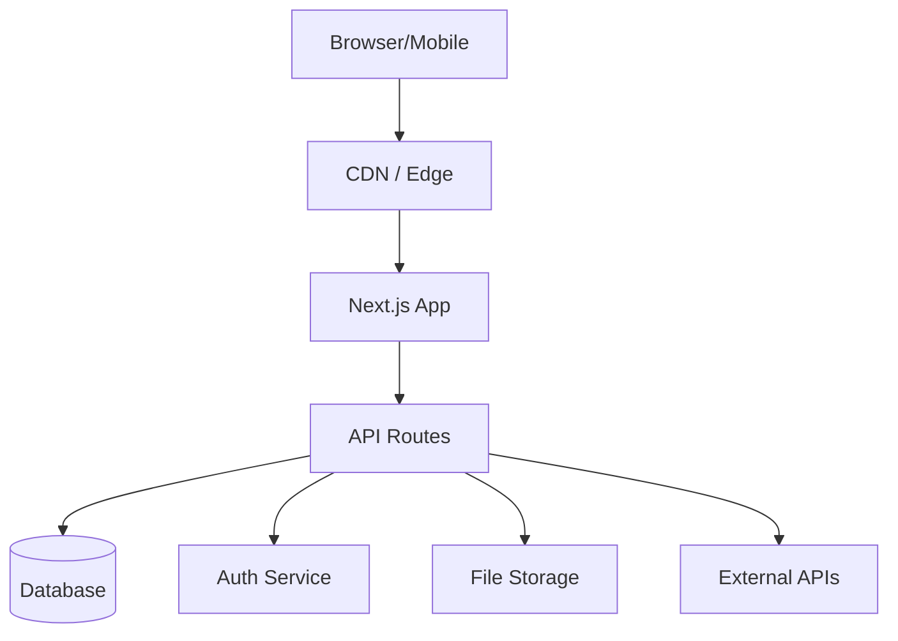
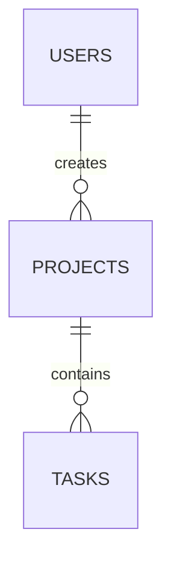
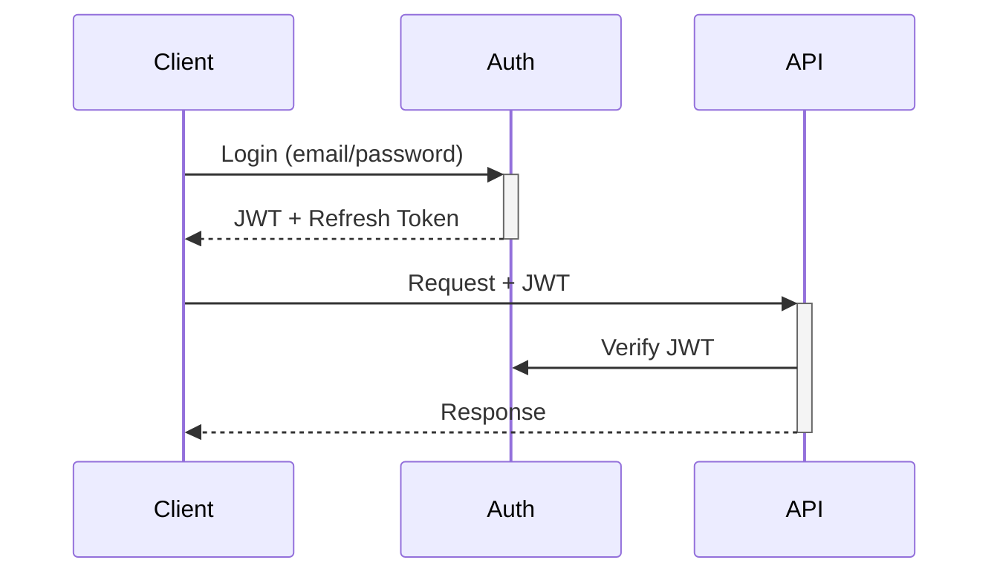

# Technical Architecture: [Product Name]

> Version: 1.0
> Date: [date]
> Status: Pending Approval
> Based on: P1 PRD

## 1. Technology Stack

| Layer | Choice | Rationale |
|-------|--------|-----------|
| Frontend | | |
| Styling | | |
| Backend / API | | |
| Database | | |
| Auth | | |
| Storage | | |
| Hosting | | |

## 2. System Architecture

### Architecture Diagram



### Component Descriptions

| Component | Responsibility |
|-----------|---------------|
| | |

## 3. Project Structure

```
project-root/
├── src/
│   ├── app/                    # Next.js App Router
│   │   ├── (auth)/             # Auth-required routes
│   │   ├── (public)/           # Public routes
│   │   ├── api/                # API routes
│   │   └── layout.tsx          # Root layout
│   ├── components/
│   │   ├── ui/                 # Design system components
│   │   └── features/           # Feature-specific components
│   ├── lib/                    # Utilities, clients, helpers
│   ├── hooks/                  # Custom React hooks
│   └── types/                  # TypeScript type definitions
├── tests/
│   ├── unit/
│   ├── integration/
│   └── e2e/
├── public/                     # Static assets
└── supabase/
    └── migrations/             # Database migrations
```

## 4. Database Schema

### Tables

#### [table_name]
| Column | Type | Constraints | Description |
|--------|------|-------------|-------------|
| id | uuid | PK, DEFAULT gen_random_uuid() | |
| created_at | timestamptz | NOT NULL, DEFAULT now() | |

### Relationships



### Index Strategy

| Table | Index | Columns | Type | Rationale |
|-------|-------|---------|------|-----------|
| | | | btree | |

### RLS Policies

| Table | Policy | Rule |
|-------|--------|------|
| | | |

## 5. API Design

| Method | Path | Auth | Description | Request Body | Response |
|--------|------|------|-------------|-------------|----------|
| GET | `/api/v1/...` | Yes | | — | `{ data: [...] }` |
| POST | `/api/v1/...` | Yes | | `{ ... }` | `{ data: {...} }` |

### Error Response Format

```json
{
  "error": {
    "code": "VALIDATION_ERROR",
    "message": "Human-readable message",
    "details": {}
  }
}
```

## 6. Authentication & Authorization

### Auth Flow



### Roles & Permissions

| Role | Permissions |
|------|------------|
| | |

### Session Management
- [Token type, expiry, refresh strategy]

## 7. Third-party Integrations

| Service | Purpose | Fallback |
|---------|---------|----------|
| | | |

## 8. Performance Strategy

### Caching
- [What is cached, where, TTL]

### Rendering Strategy

| Page | Strategy | Rationale |
|------|----------|-----------|
| `/` | SSG | Static content |
| `/dashboard` | SSR | User-specific |

### Asset Optimization
- Images: next/image with WebP, lazy loading
- Fonts: display=swap, preloaded
- JS: Code splitting per route

### Database Optimization
- Connection pooling via [method]
- Query result caching for [scenarios]

## 9. Security Strategy

### Input Validation
- Zod schemas on all API inputs
- Max length/size constraints

### CSRF/XSS/Injection Prevention
- CSRF: [method]
- XSS: React auto-escaping + CSP headers
- SQL Injection: Parameterized queries via ORM

### Rate Limiting
- Auth endpoints: [X] req/min
- API endpoints: [X] req/min

### Secrets Management
- Environment variables via [Vercel/platform]
- Never exposed to client bundle

### CORS Policy
- Allowed origins: [specific domains]

## 10. Self-Review Log

### Round 1: Security Review
- [Finding 1]: [remediation]

### Round 2: Performance Review
- [Finding 1]: [optimization]
